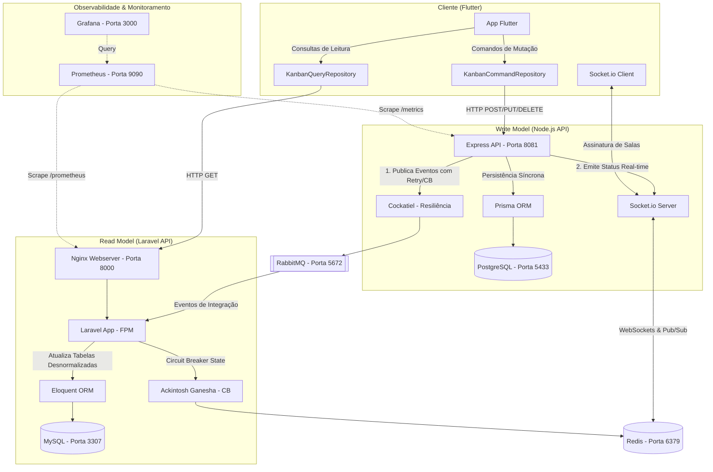

# 🎯 Sistema de Gestão de Reuniões e Kanban (Arquitetura CQRS)

[](https://github.com/allanwxavier/projeto-topicos-avan-ados-programa-o-/actions/workflows/ci.yml)
[](https://sonarcloud.io/summary/new_code?id=<project-key>)
[](https://sonarcloud.io/summary/new_code?id=<project-key>)

Este projeto foi desenvolvido como trabalho final e prático para a disciplina de **Tópicos Avançados em Computação (TAC)**. Ele consiste em uma solução distribuída e altamente resiliente focada em **Arquitetura Moderna de Software**, aplicando os padrões de **CQRS** (Command Query Responsibility Segregation), comunicação assíncrona orientada a eventos, real-time reativo, e uma esteira completa de observabilidade e resiliência.

---

## 🏗️ 1. Arquitetura e Funcionamento

O sistema adota a segregação de responsabilidades de escrita e leitura (**CQRS**), permitindo escalar os microsserviços de forma independente e otimizar os bancos de dados para seus respectivos propósitos.



### ✍️ Write Model (Escrita) — Node.js & PostgreSQL
*   **Tecnologia:** Node.js com TypeScript e Express.
*   **Porta:** `8081`
*   **Persistência:** PostgreSQL (via Prisma ORM), porta exposta `5433`.
*   **Comportamento:** Processa os comandos de alteração de estado (criação, atualização, movimentação e remoção de cards do Kanban, além do agendamento de reuniões).
*   **Integração:** Após salvar as alterações no banco PostgreSQL, o microsserviço publica eventos de integração (ex: `CardCriadoEvent`, `CardMovidoEvent`) na fila `kanban_events` ou `reuniao_events` do RabbitMQ.
*   **Resiliência:** A publicação na fila conta com uma política de resiliência utilizando **Cockatiel**, configurada com **Retry** (3 tentativas com backoff exponencial) e **Circuit Breaker** (abre após 5 falhas consecutivas e aguarda 10 segundos no estado *open* antes de transitar para *half-open*).
*   **Reatividade:** Utiliza **Socket.io** para comunicação bidirecional com os clientes conectados, permitindo atualizações de tela instantâneas. O Socket.io usa o Redis como adapter de Pub/Sub para escalabilidade horizontal.

### 📖 Read Model (Leitura) — Laravel & MySQL
*   **Tecnologia:** PHP 8.2+ com Laravel 11.
*   **Porta:** `8000` (através de um servidor Nginx que atua como proxy reverso para o PHP-FPM).
*   **Persistência:** MySQL (via Eloquent ORM), porta exposta `3307`.
*   **Comportamento:** Atua estritamente como modelo de leitura para garantir alta performance de busca e listagem.
*   **Sincronização:** Consome os eventos do RabbitMQ emitidos pelo Write Model por meio de workers assíncronos. Ao receber um evento de criação ou alteração, atualiza a tabela desnormalizada de leitura (`cards_read`, `reunioes_read`).
*   **Resiliência:** O consumo de filas e integrações externas no Laravel utiliza o **Circuit Breaker** (via biblioteca `Ackintosh Ganesha` armazenando estados no Redis) para evitar sobrecarga em caso de indisponibilidade de serviços de infraestrutura.

### 📱 Frontend — Flutter (Optimistic UI & Consistência Eventual)
*   **Tecnologia:** Flutter (Dart) compatível com Mobile, Web e Desktop.
*   **Comportamento:** O aplicativo aplica os conceitos de CQRS no próprio client:
    *   Consultas (`GET /cards`, `GET /cards/{id}`) são disparadas exclusivamente contra a API do Laravel (Read Model na porta `8000`).
    *   Comandos (`POST`, `PUT`, `DELETE`) de mutação são enviados exclusivamente para a API Node.js (Write Model na porta `8081`).
*   **Optimistic UI:** Para uma experiência fluida, a interface do usuário é atualizada de forma *otimista* antes da resposta do servidor. Um estado de sincronização (`SyncStatus`: *pending* → *syncing* → *confirmed* → *failed*) é exibido visualmente no card. Caso o Write Model retorne uma falha, o Flutter realiza o rollback automático do estado local.
*   **WebSockets:** Escuta eventos Socket.io emitidos pelo Node.js para atualizar reativamente as mudanças ocorridas por ações de outros usuários (colaboração real-time).

---

## 🛠️ 2. Tecnologias e Ferramentas

O projeto utiliza um conjunto de tecnologias modernas adequadas para ambientes de microsserviços distribuídos:

*   **Linguagens de Programação:** TypeScript (JavaScript) e PHP (Laravel) no backend, Dart (Flutter) no frontend.
*   **Bancos de Dados:**
    *   **PostgreSQL 15:** Banco relacional transacional otimizado para gravação.
    *   **MySQL 8.0:** Banco relacional otimizado para consultas rápidas e desnormalizadas.
    *   **Redis 7:** Armazenamento chave-valor em memória utilizado como adapter pub/sub do Socket.io e cache/estado do Circuit Breaker.
*   **Mensageria:** **RabbitMQ 3 (Alpine)** para entrega de mensagens assíncronas e consistência eventual entre microsserviços.
*   **ORMs & Data Mappers:** Prisma ORM (Node.js) e Eloquent ORM (Laravel).
*   **Resiliência:**
    *   **Cockatiel (JS/TS):** Políticas de Retry e Circuit Breaker na API de Escrita.
    *   **Ganesha (PHP):** Circuit Breaker integrado ao Redis na API de Leitura.
*   **Observabilidade e Monitoramento:**
    *   **Prometheus:** Coleta periódica de métricas técnicas e de negócios expostas pelos microsserviços.
    *   **Grafana:** Dashboard interativo configurado para exibir taxa de requisições, latência P95 e volumetria do negócio.
    *   **Logs JSON Estruturados:** Pino-HTTP (Node.js) e Monolog (Laravel) gerando saídas padronizadas com propagação de **Correlation ID** (`X-Correlation-Id`) no header das chamadas HTTP.
    *   **Health Checks:** Endpoints `/health/live` e `/health/ready` integrados nativamente.

---

## 📦 3. Pré-requisitos

Para rodar todo o ecossistema localmente, você precisará ter instalado na sua máquina:

1.  **Docker & Docker Compose** (ou Docker Desktop / Colima).
2.  **Git** (para clonagem dos repositórios).
3.  **Flutter SDK 3.x** (caso queira rodar o aplicativo cliente).

---

## 📂 4. Estrutura de Pastas Obrigatória

Os dois repositórios de backend e frontend precisam estar clonados **lado a lado** no mesmo diretório pai para que as referências relativas do Docker Compose funcionem corretamente:

```text
~/projetos/                                      ← Diretório pai comum
├── projeto-topicos-avan-ados-programa-o-/       ← Repositório Principal (Allan)
│   ├── docker-compose.yml                       ← Orquestrador do Docker
│   ├── backend/                                 ← Write Model (Node.js API)
│   ├── lib/                                     ← Aplicativo Cliente (Flutter)
│   └── prometheus.yml                           ← Configuração do Prometheus
└── MicroSaas_To_do/                             ← Repositório Auxiliar (Murilo)
    └── php-service/                             ← Read Model (Laravel API)
```

### Comandos para clonagem:
```bash
mkdir projetos && cd projetos
git clone https://github.com/allanwxavier/projeto-topicos-avan-ados-programa-o-.git
git clone https://github.com/Murilo11/MicroSaas_To_do.git
```

---

## ▶️ 5. Como Executar o Projeto

A partir do diretório raiz do repositório principal (`projeto-topicos-avan-ados-programa-o-`):

### 1. Inicializar toda a infraestrutura e microsserviços
Suba os containers utilizando o Docker Compose:
```bash
docker compose up --build -d
```
*Este comando baixa as imagens necessárias, executa as compilações (builds) locais da API Node e do Laravel, e inicia os bancos de dados, mensageria e painéis de monitoramento.*

### 2. Executar as Migrations e Setup do Banco de Leitura
Para que o banco MySQL do Laravel crie a estrutura de dados correta, execute as migrações:
```bash
docker compose exec laravel-app php artisan migrate
```

### 3. Executar o Cliente Flutter
Navegue até a pasta raiz e inicialize o Flutter:
```bash
flutter run
```
*Se você estiver testando no emulador Android, a comunicação local já está configurada de forma transparente apontando para as portas adequadas.*

### 4. Gerenciamento do Ambiente
*   **Parar containers (mantendo dados):** `docker compose down`
*   **Reset completo (apagando volumes e dados dos bancos):** `docker compose down -v`
*   **Verificar saúde dos containers:** `docker compose ps`

---

## 🌐 6. Endpoints Principais & Como Testar

Após subir o ambiente, as seguintes portas e serviços estarão acessíveis localmente:

| Serviço | URL / Porta | Descrição |
| :--- | :--- | :--- |
| **Node API (Write)** | `http://localhost:8081` | Recebe as mutações, salva no PostgreSQL e publica eventos |
| **Laravel API (Read)** | `http://localhost:8000` | Recebe as consultas de leitura a partir do MySQL |
| **Swagger UI (Node)** | `http://localhost:8081/api/docs` | Documentação OpenAPI interativa da API de Escrita |
| **RabbitMQ Management**| `http://localhost:15672` | Console de monitoramento de filas (user: `admin` / pass: `admin123`) |
| **Prometheus UI** | `http://localhost:9090` | Painel de visualização e coleta de métricas |
| **Grafana Dashboard** | `http://localhost:3000` | Painel de controle visual (user: `admin` / pass: `admin`) |
| **PostgreSQL** | `localhost:5433` | Banco de dados da Escrita (user: `meetsync` / pass: `meetsync123`) |
| **MySQL** | `localhost:3307` | Banco de dados da Leitura (user: `laravel` / pass: `laravel123`) |

### 🧪 Testando os Microsserviços via CLI

#### 1. Verificar Disponibilidade da API de Escrita (Node.js)
```bash
curl -i http://localhost:8081/health/live
```
**Resposta esperada:** HTTP `200 OK` com `{"status":"ok","message":"API a correr!"}`

#### 2. Verificar Readiness da API de Escrita (Valida conexões do Postgres, Redis e RabbitMQ)
```bash
curl -i http://localhost:8081/health/ready
```
**Resposta esperada:** HTTP `200 OK` caso todos os serviços externos estejam conectados. Retorna `503 Service Unavailable` em caso de queda de alguma dependência.

#### 3. Verificar Disponibilidade do Read Model (Laravel)
```bash
curl -i http://localhost:8000/api/health/live
```
**Resposta esperada:** HTTP `200 OK` com `{"status":"alive"}`.

#### 4. Verificar Readiness do Read Model (Valida MySQL, Redis e armazenamento)
```bash
curl -i http://localhost:8000/api/health/ready
```
**Resposta esperada:** Retorno formatado em JSON contendo o status de saúde de cada componente monitorado pelo Spatie Health Check.

### ⚡ Simulando Resiliência (Circuit Breaker e Retry)

1.  **Derrube a mensageria:**
    ```bash
    docker compose stop rabbitmq
    ```
2.  **Envie comandos de escrita:** Tente disparar uma mutação (como criar um card) enviando um POST para o Node.js.
3.  **Monitore as tentativas nos logs:**
    ```bash
    docker compose logs node-api | grep "Retry"
    ```
    *Você verá a API do Node tentando publicar o evento repetidamente seguindo o backoff exponencial.*
4.  **Verifique a abertura do circuito:** Após 5 tentativas consecutivas de falha, o Circuit Breaker abrirá. Chamadas subsequentes retornarão erro imediato sem onerar o sistema.
5.  **Restabeleça a mensageria:**
    ```bash
    docker compose start rabbitmq
    ```
    *Aguarde 10 segundos para que a API transite para "half-open" e feche novamente o circuito ao processar uma requisição com sucesso.*